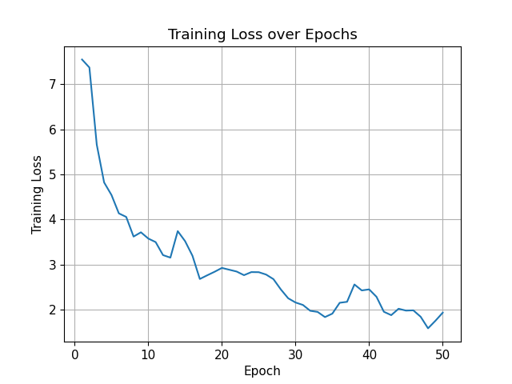
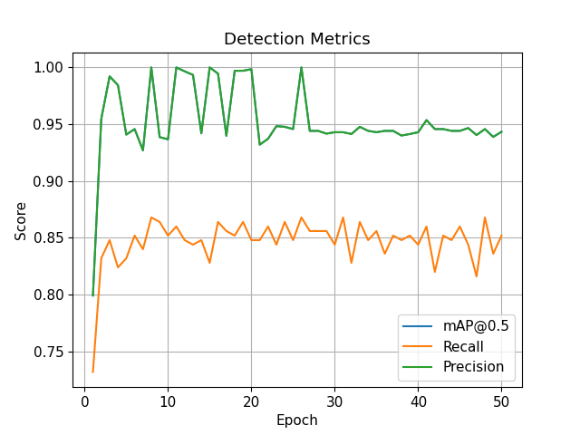
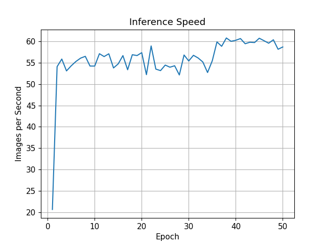
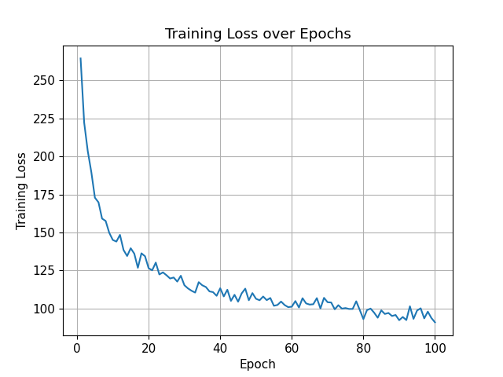
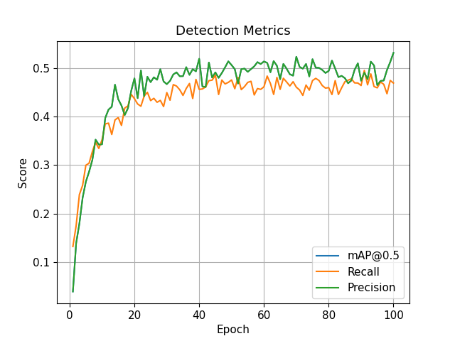
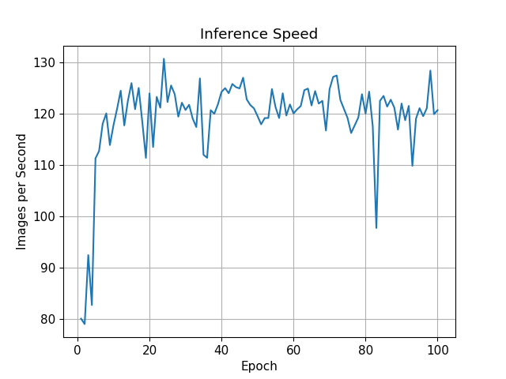
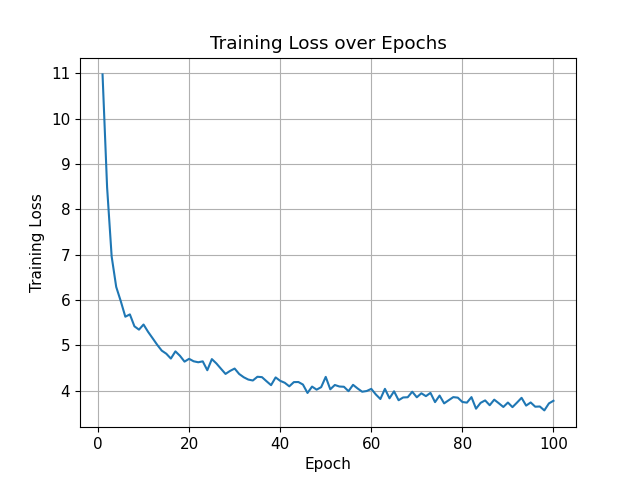
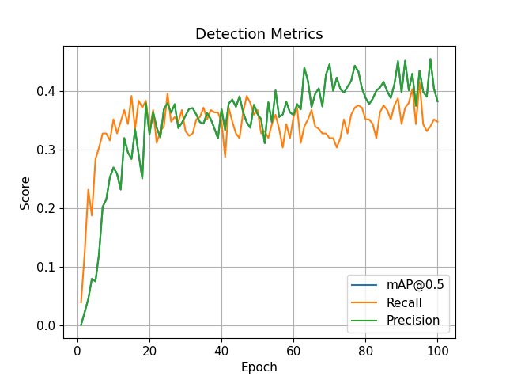
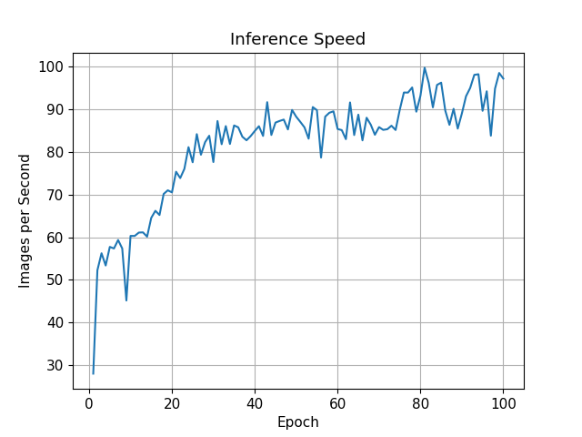

# Object Detection with Faster R-CNN and YOLOv5 (PyTorch)

This repository presents a comparative study of two modern object detection architectures implemented in PyTorch: Faster R-CNN and YOLOv5. The goal of the project is to provide a clear, reproducible framework for students and researchers beginning to explore object detection, while also offering a realistic comparison between two-stage and single-stage detectors on small and medium-scale datasets.

The experiments focus on fine-tuning pre-trained models, evaluating them using COCO-style metrics, and analyzing convergence behavior, accuracy, speed, and practical trade-offs.

---

## Introduction

Object detection requires a model to simultaneously determine what objects are present in an image and where they are located. Modern deep learning detectors approach this problem in different ways, leading to important trade-offs in performance and efficiency.

In this project, we compare:

* A two-stage detector: Faster R-CNN
* A single-stage detector: YOLOv5

Two-stage detectors first generate region proposals and then classify them. Single-stage detectors perform localization and classification in a single forward pass. These structural differences influence accuracy, convergence speed, computational cost, and robustness — all of which are examined in this work.

---

## Dataset Description

### Penn-Fudan Pedestrian Dataset

The Penn-Fudan Pedestrian Dataset contains images of pedestrians in urban street scenes with bounding box annotations. In this project, it is treated as a single-class detection task.

Because the dataset is relatively small, it provides a useful testbed for studying transfer learning and fine-tuning pre-trained detection architectures.

### Oxford-IIIT Pet Dataset

The Oxford-IIIT Pet Dataset contains images of 37 cat and dog breeds. In these experiments, only 5 breeds were used. The dataset is adapted for object detection by using bounding box annotations and breed labels.

This dataset forms a multi-class detection problem, which is more challenging than Penn-Fudan due to increased class diversity and intra-class variation.

---

## Model Explanation

### Faster R-CNN

The Faster R-CNN implementation uses a MobileNetV3 backbone with a Feature Pyramid Network (FPN). The model operates in two stages: first generating candidate object regions using a Region Proposal Network (RPN), and then refining and classifying those regions.

This architecture is known for strong localization accuracy and robustness, particularly on smaller datasets where high-quality region proposals can significantly improve detection precision.

Pre-trained weights are pulled from TorchVision and fine-tuned on the new datasets. This enables effective transfer learning even with limited training data.

---

### YOLOv5 (YOLOv5n)

The YOLOv5 implementation uses the lightweight nano variant (YOLOv5n). YOLO performs detection in a single forward pass, directly predicting bounding boxes and class probabilities.

In this project:

* Pre-trained weights are loaded.
* The detection head is adapted for the dataset's number of classes.
* The backbone is frozen.
* Only the detection head is fine-tuned.

This approach reduces overfitting risk on small datasets but limits full adaptation. To ensure consistency with Faster R-CNN training pipelines, YOLO weights are manually loaded and trained with PyTorch scripts, though some Ultralytics utilities are included via a git submodule.

---

## Training Details

Training was conducted using PyTorch with GPU acceleration. Metrics were evaluated using COCO-style metrics via `torchmetrics`, including:

* mAP@0.5
* mAP@0.5:0.95
* Precision
* Recall
* Inference speed (images per second)

Faster R-CNN was trained for 50 epochs using Adam with a learning rate of 1e-4. YOLOv5 experiments were run for 100-300 epochs using a learning rate of 5e-4 and batch size of 8.

Faster R-CNN proved easy to train and robust to hyperparameter variance. YOLOv5 required more epochs and careful learning rate adjustment, as well as relatively large batch sizes to stabilize gradient updates.

Metrics were logged per epoch for visualization.

All tests in this report were run on a Ryzen 9 7950X CPU with an RTX 2070 Super GPU.

---

## Results

| Dataset                | Model        | mAP@0.5 | mAP@0.5:0.95 | Precision | Recall | FPS |
| ---------------------- | ------------ | ------- | ------------ | --------- | ------ | --- |
| Penn Fudan Pedestrian  | Faster R-CNN | 0.94    | 0.82         | 0.94      | 0.85   | 59  |
| Penn Fudan Pedestrian  | YOLO         | 0.57    | 0.14         | 0.57      | 0.39   | 58  |
| Oxford Pets (5 Breeds) | Faster R-CNN | 0.96    | 0.75         | 0.97      | 0.79   | 69  |
| Oxford Pets (5 Breeds) | YOLO         | 0.49    | 0.25         | 0.49      | 0.50   | 72  |

Faster R-CNN converged quickly, achieving high precision and mAP on both datasets. YOLO improved gradually but plateaued around mAP@0.5 ≈ 0.49-0.57. The improved YOLO results on the new machine highlight that hardware can significantly affect training dynamics and convergence, though it still did not reach R-CNN performance.

---

## Visualizations

### Faster R-CNN - Penn Fudan

| Loss Curve                                                | Metrics Curve                                                   |
| --------------------------------------------------------- | --------------------------------------------------------------- |
|  |  |

| Sample Predictions                                                        | Speed Curve                                                 |
| ------------------------------------------------------------------------- | ----------------------------------------------------------- |
|  |  |

### YOLOv5 - Oxford Pets

| Loss Curve                                                  | Metrics Curve                                                     |
| ----------------------------------------------------------- | ----------------------------------------------------------------- |
|  |  |

| Sample Predictions                                                          | Speed Curve                                                   |
| --------------------------------------------------------------------------- | ------------------------------------------------------------- |
|  |  |

### YOLOv5 - Penn Fudan

| Loss Curve                                               | Metrics Curve                                                  |
| -------------------------------------------------------- | -------------------------------------------------------------- |
|  |  |

| Sample Predictions                                                       | Speed Curve                                                |
| ------------------------------------------------------------------------ | ---------------------------------------------------------- |
|  |  |

These visualizations confirm the convergence trends observed in the metrics tables.

---

## Discussion

The experiments show a clear performance gap between Faster R-CNN and YOLOv5 on small datasets. Faster R-CNN achieved near-perfect precision and high mAP on both datasets, converging rapidly and producing accurate bounding boxes.

YOLOv5, while faster in inference, plateaued in performance. On the pedestrian dataset, mAP@0.5 reached ~0.57, and on the Oxford Pets dataset it stabilized around ~0.49. Improvements beyond ~100 epochs were marginal, indicating that freezing the backbone limited its adaptability. Training on the new machine improved YOLO performance slightly, but the gap to Faster R-CNN remains significant.

Checkpoint sizes also differed substantially. Faster R-CNN's model files were much larger due to the heavier backbone and region proposal network, whereas YOLO remained lightweight, offering a trade-off between storage and accuracy.

Inference speed differences were less dramatic than expected: YOLO was faster, but Faster R-CNN still ran in real-time for these datasets (~40-60 FPS), showing that small-scale experiments can make both models viable for interactive tasks.

Overall, for small academic datasets:

* Two-stage detectors like Faster R-CNN provide more reliable and higher-quality detection.
* Single-stage detectors like YOLOv5 may require full fine-tuning, larger datasets, or additional augmentation to reach comparable performance.
* Model size and training stability are practical considerations alongside accuracy.

---

## Conclusion

Object detection is a complex problem with significant architectural trade-offs. This study shows:

* Faster R-CNN achieves high precision and mAP quickly, even on small datasets.
* YOLOv5 benefits from hardware and careful training but remains less accurate in this context.
* YOLOv5 is lightweight and fast, highlighting the trade-off between inference speed and detection quality.

These results provide a practical framework for students and researchers to understand how architecture, dataset size, and fine-tuning strategy affect object detection performance. The repository supports further experimentation with full YOLO backbone fine-tuning, data augmentation, and evaluation on larger datasets.
Here's a clean, beginner-friendly **Setup & Run** section you can add to the end of your README. I've simplified the commands, removed unnecessary flags, and included instructions for datasets and visualizations.

---

## Setup & Running the Project

This section explains how to get the project running from scratch, including installing dependencies, preparing datasets, training models, and visualizing results.

### 1. Install Dependencies

Ensure you have Python 3.8+ and CUDA installed (if using GPU). Then install the required Python packages:

```bash
pip install -r requirements.txt
```

This will install PyTorch, TorchVision, TorchMetrics, and other necessary libraries.

---

### 2. Download and Prepare the Datasets

The repository includes scripts to download the datasets and generate JSON splits.

**Download default datasets:**

```bash
python generate_splits.py --dl-only
```

This will download the Penn-Fudan Pedestrian dataset and the Oxford-IIIT Pet dataset (subset of breeds used in this project). When running training, you will use the pre-made splits included in this repository.

**Optional:** You can create custom splits or limit the number of pet breeds:

```bash
python generate_splits.py --pet_breeds 10
```

---

### 3. Train a Model

Models can be trained using `train.py`. Two options are supported: Faster R-CNN and YOLOv5.

**Example: Train Faster R-CNN on Penn-Fudan Pedestrians:**

```bash
python train.py --model rcnn --dataset penn --splits pennfudan_splits.json --checkpoints checkpoints/r-cnn/PennFudanPed
```

**Example: Train YOLOv5 on Oxford Pets:**

```bash
python train.py --model yolo --dataset pet --splits pet_splits.json --checkpoints checkpoints/yolo/oxford-iiit-pet
```

---

### 4. Visualize Training Metrics and Predictions

After training, metrics and predictions can be visualized using `plot_metrics.py`. This generates loss curves, mAP curves, sample predictions, and speed plots.

**Example: Visualize Faster R-CNN results on Penn-Fudan:**

```bash
python plot_metrics.py --dataset penn --splits pennfudan_splits.json --model rcnn --checkpoint ./checkpoints/r-cnn/PennFudanPed/epoch_50.pth --output ./vis/r-cnn/PennFudanPed/
```

**Example: Visualize YOLOv5 results on Oxford Pets:**

```bash
python plot_metrics.py --dataset pet --splits pet_splits.json --model yolo --checkpoint ./checkpoints/yolo/oxford-iiit-pet/epoch_100.pth --output ./vis/yolo/oxford-iiit-pet/
```

The output folder will contain:

* `loss_curve.png` - Training loss over epochs
* `metrics_curve.png` - mAP, precision, and recall curves
* `sample_predictions.png` - Example detections on validation images
* `speed_curve.png` - Inference speed over the dataset
